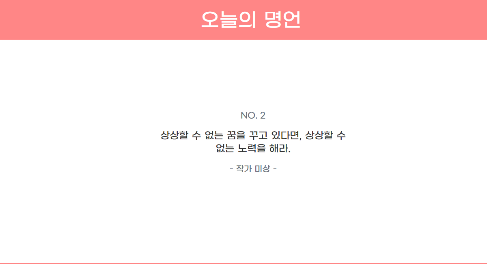
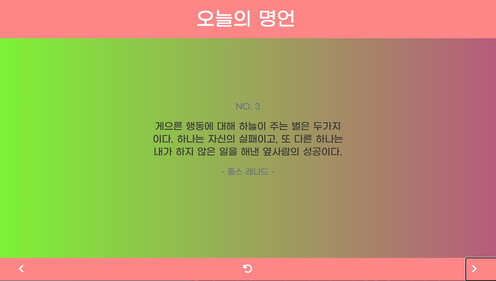
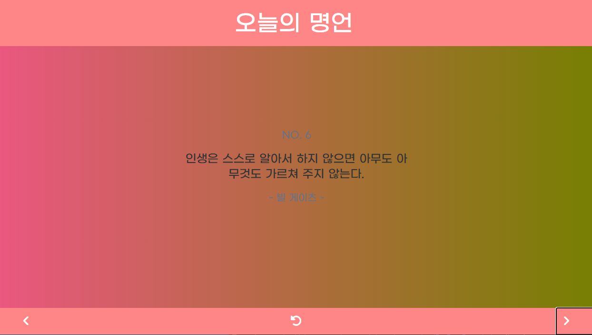

<div id="top"></div>
<!--
*** Thanks for checking out the Best-README-Template. If you have a suggestion
*** that would make this better, please fork the repo and create a pull request
*** or simply open an issue with the tag "enhancement".
*** Don't forget to give the project a star!
*** Thanks again! Now go create something AMAZING! :D
-->

<!-- PROJECT SHIELDS -->
<!--
*** I'm using markdown "reference style" links for readability.
*** Reference links are enclosed in brackets [ ] instead of parentheses ( ).
*** See the bottom of this document for the declaration of the reference variables
*** for contributors-url, forks-url, etc. This is an optional, concise syntax you may use.
*** https://www.markdownguide.org/basic-syntax/#reference-style-links
-->


<!-- PROJECT LOGO -->
<br />
<div align="center">
  <a href="https://github.com/kimdonghyeon3/WiseSaying_Of_The_Today">
    
  </a>

<h3 align="center">오늘의 명언</h3>

  <p align="center">
    약 100가지의 명언을 볼 수 있는 사이트
    <br />
    <a href="https://wisesayingofthetoday.netlify.app/"><strong>View Demo »</strong></a>
    <br />
    <br />

  </p>
</div>


<!-- ABOUT THE PROJECT -->
## About The Project



Json파일로 만들어진 명언 데이터를 간단한 UI/UX를 통해 ID별로 넘겨보기 및 랜덤으로 명언 보기 등의 기능을 수행하는 사이트이다.
기본적으로 이전 JavaSSG프로젝트에서 생성된 data.json을 활용해 제작하였다.

<p align="right">(<a href="#top">back to top</a>)</p>

### Built With
     
<p align="right">(<a href="#top">back to top</a>)</p>

<!-- GETTING STARTED -->
## Getting Started

배포가 완료된 프로젝트 입니다! DemoLink를 확인해 주세요

### 설치 방법

1. Clone the repo
   ```sh
   git clone https://github.com/kimdonghyeon3/WiseSaying_Of_The_Today.git
   ```

2. Install NPM packages
   ```sh
   npm install
   ```
3. Run Start
   ```sh
   npm start
      ```
<p align="right">(<a href="#top">back to top</a>)</p>

<!-- USAGE EXAMPLES -->
## Usage

좌, 우, 랜덤 버튼을 통해 명언 보기


<p align="right">(<a href="#top">back to top</a>)</p>

<!-- DEMO EXAMPLES -->
## Demo




<p align="right">(<a href="#top">back to top</a>)</p>

<!-- CONTACT -->
## Contact

Email - kimdonghyeon98@gmail.com

Project Link: [https://github.com/kimdonghyeon3/WiseSaying_Of_The_Today](https://github.com/kimdonghyeon3/WiseSaying_Of_The_Today)

<p align="right">(<a href="#top">back to top</a>)</p>


MIT License
Copyright (c) 2021 Othneil Drew

<!-- MARKDOWN LINKS & IMAGES -->
<!-- https://www.markdownguide.org/basic-syntax/#reference-style-links -->
[contributors-shield]: https://img.shields.io/github/contributors/github_username/repo_name.svg?style=for-the-badge
[contributors-url]: https://github.com/github_username/repo_name/graphs/contributors
[forks-shield]: https://img.shields.io/github/forks/github_username/repo_name.svg?style=for-the-badge
[forks-url]: https://github.com/github_username/repo_name/network/members
[stars-shield]: https://img.shields.io/github/stars/github_username/repo_name.svg?style=for-the-badge
[stars-url]: https://github.com/github_username/repo_name/stargazers
[issues-shield]: https://img.shields.io/github/issues/github_username/repo_name.svg?style=for-the-badge
[issues-url]: https://github.com/github_username/repo_name/issues
[license-shield]: https://img.shields.io/github/license/github_username/repo_name.svg?style=for-the-badge
[license-url]: https://github.com/github_username/repo_name/blob/master/LICENSE.txt
[linkedin-shield]: https://img.shields.io/badge/-LinkedIn-black.svg?style=for-the-badge&logo=linkedin&colorB=555
[linkedin-url]: https://linkedin.com/in/linkedin_username
[product-screenshot]: images/screenshot.png
